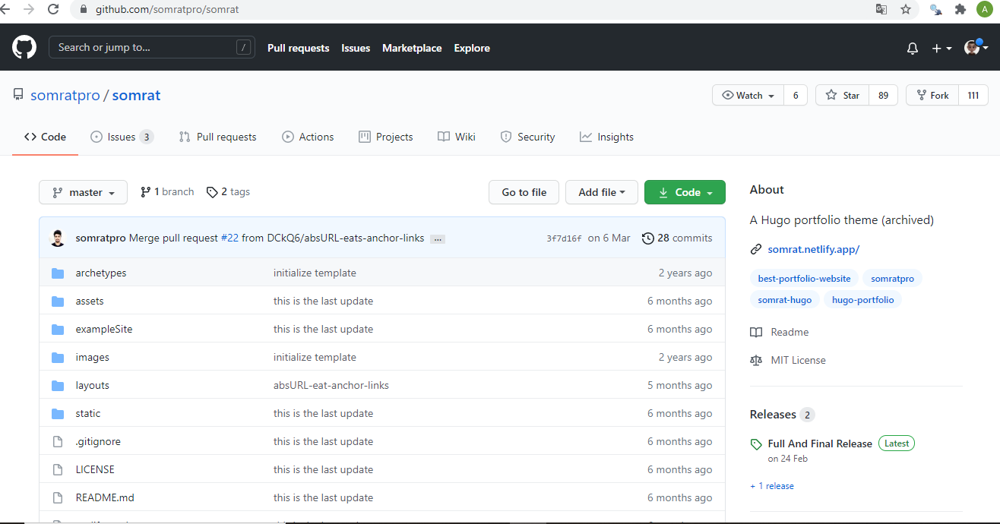

# Passo 1

O primeiro passo antes de iniciar com a construção do seu blog ou site deve acessar o link de [Temas **HUGO**](https://themes.gohugo.io/) que disponibiliza modelos prontos, em que você pode customizar como você desejar, o que torna bem mais rápido o processo. A escolha fica a seu critério, levando em conta, seu objetivos, nível de customização,etc.

O tema que escolhi se chama **Somrat**, meu objetivo com ele é constuir uma página para minha irmã que trabalha como *Personal Trainer*.

Após a escolha do Tema basta apenas buscar qual o repositório do
**GITHUB** está armazenado os arquivos do site, na imagem a seguir basta apenas clicar no botão **download**.

Após clicar em **download** você será direcionado para o diretório no **GITHUB** como apresentado na imagem a seguir:

Do link abaixo, precisamos do nome do usuário e repositório, como apresentado abaixo **somratpro/somrat**

# Passo 2

instalar o pacote **blogdown** com o comando **install.packages('blogdown')**

